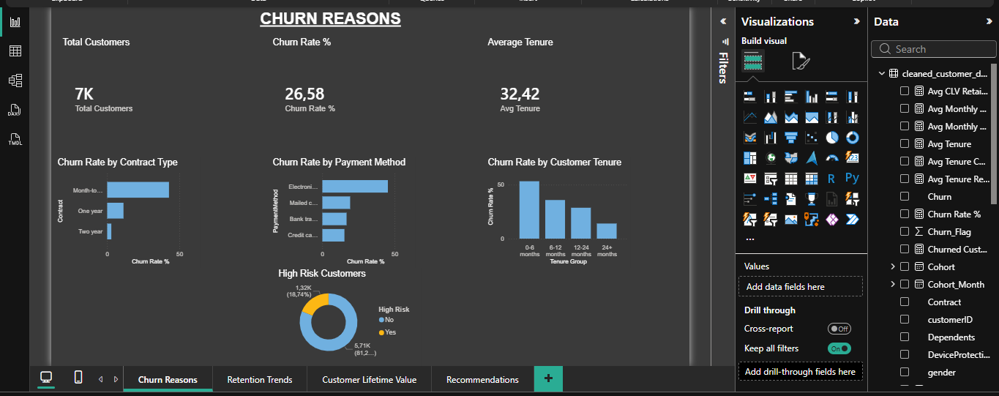
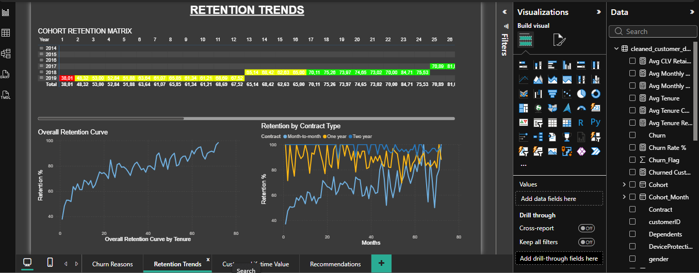
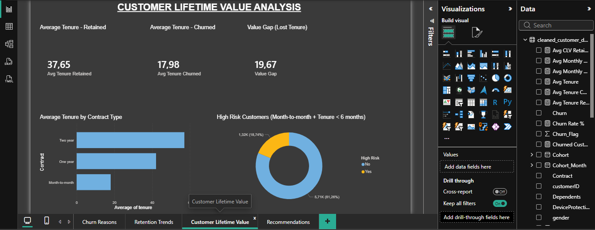
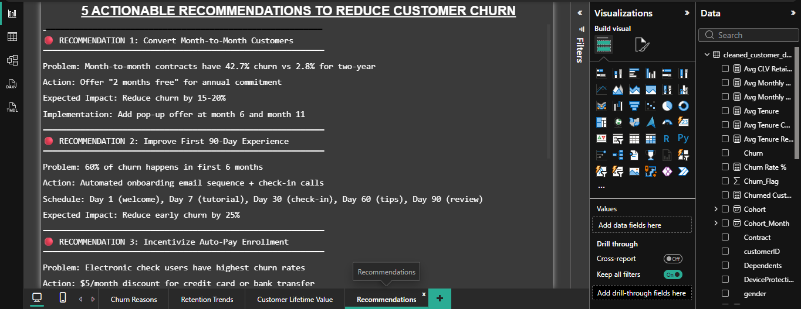

# FUTURE_DS_02 - Customer Retention & Churn Analysis

## Task 2: Customer Retention & Churn Analysis for Subscription Business

Analysis of **7,032 customers** with interactive Power BI dashboard to identify churn patterns, retention drivers, and customer lifetime trends.

### Key Metrics
- **Overall Churn Rate:** 26.6%
- **Month-to-month churn:** 42.7% (15x higher than two-year)
- **Retained customers tenure:** 37.6 months
- **Churned customers tenure:** 18.0 months
- **Value Gap:** 19.6 months (retained customers stay 20 months longer)

---

## Dashboard Preview

| Page | Preview |
|------|---------|
| Churn Reasons |  |
| Retention Trends |  |
| Customer Lifetime Value |  |
| Recommendations |  |

---

## Key Findings

| Metric | Value |
|--------|-------|
| Total Customers | 7,032 |
| Overall Churn Rate | 26.6% |
| Month-to-month churn | 42.7% |
| One year churn | 11.3% |
| Two year churn | 2.8% |
| Retained customers tenure | 37.6 months |
| Churned customers tenure | 18.0 months |
| Value Gap | 19.6 months |

### Top 3 Churn Drivers
1. **Contract Type** - Month-to-month customers churn 15x more than two-year
2. **Payment Method** - Electronic check users highest risk (35.2%)
3. **Early Tenure** - 60% of churn happens in first 6 months

---

## Recommendations

1. **Convert Month-to-Month to Annual** - Offer "2 months free" for annual commitment
2. **Improve First 90 Days** - Onboarding emails + check-in calls at days 7,30,60,90
3. **Incentivize Auto-Pay** - $5/month discount for credit card/bank transfer
4. **Early Warning System** - Flag tenure<6mo + charges>$80 → auto 20% discount
5. **Loyalty Rewards** - Milestone rewards at 12, 24, 36 months

**Expected Impact:** 25-35% overall churn reduction

---

## Files in Repository

| File | Description |
|------|-------------|
| `CustomerRetentionAndChurnAnalysis.py` | Python analysis script |
| `cleaned_customer_data.csv` | Processed dataset |
| `FUTURE_DS_02.pbix` | Power BI dashboard |
| `BUSINESS_INSIGHTS.md` | Detailed business insights |
| `Page1_Churn_Reasons.png` | Dashboard screenshot |
| `Page2_Retention_Trends.png` | Dashboard screenshot |
| `Page3_Customer_Lifetime_Value.png` | Dashboard screenshot |
| `Page4_Recommendations.png` | Dashboard screenshot |

---

## Tools Used
- **Python** (pandas, matplotlib, seaborn) - Data cleaning & analysis
- **Power BI** - Interactive dashboard
- **Excel** - Data validation

---

## Connect With Me
[Your LinkedIn URL]

---
**Future Interns - Data Science & Analytics**
